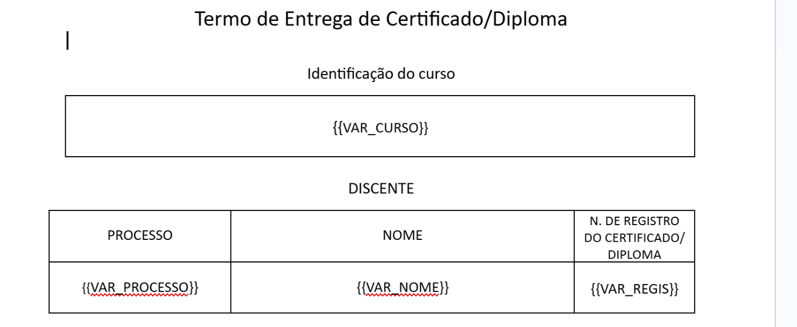

# 🚀 PREENCHEDOR

Programa com o objetivo de automatizar o preenchimento dos Termos de Entrega de Certificados e Diplomas.

## 📖 Manual de Uso

Siga os passos abaixo para gerar os documentos automaticamente:

1.  **Selecione a Lista de Dados**

      * No primeiro campo, clique em "Selecionar" e escolha a planilha Excel (`.xlsx`) que contém as informações do curso, processo, nome e número de registro.

2.  **Selecione o Modelo do Termo**

      * No segundo campo, escolha o arquivo Word (`.docx`) que servirá como modelo.
      * **Importante:** Você pode usar e modificar qualquer modelo, desde que coloque as variáveis nos locais onde as informações devem ir, escritas exatamente da seguinte forma:

| Variável | Descrição |
| :--- | :--- |
| `{{VAR_CURSO}}` | Identificação do curso |
| `{{VAR_PROCESSO}}` | Número do processo |
| `{{VAR_NOME}}` | Nome completo do discente |
| `{{VAR_REGIS}}` | Número de registro do certificado/diploma |



3.  **Selecione a Pasta de Destino**

      * No terceiro campo, clique em "Selecionar" e escolha a pasta onde os documentos preenchidos serão salvos.

4.  **Inicie o Processo**

      * Clique no botão **"Gerar Documentos"**.

5.  **Acompanhe o Status**

      * Na parte inferior da janela, uma caixa de texto mostrará o andamento do programa, informando quais documentos foram criados com sucesso e quais registros apresentaram erros.

6.  **Resultado Final**

      * Ao final do processo, os arquivos `.docx` preenchidos serão salvos na pasta de destino que você escolheu, cada um nomeado com o nome do respectivo aluno.

-----

## ⚙️ Dependências

Para que o programa funcionasse, as seguintes bibliotecas foram instaladas usando o `pip`.

```bash
pip install customtkinter
pip install openpyxl
pip install docxtpl
pip install pyinstaller
```